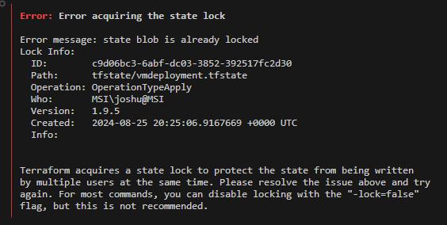

# Terraform Remote Backend

## Aim
* Deploy terraform config. whilst showcasing state locking and remote backend configuration 
* Deployment is performed using the Azure CLI and Terraform installed in your environment.
  * **[Install Azure CLI](https://learn.microsoft.com/en-us/cli/azure/install-azure-cli)**
  * **[Install Terraform](https://developer.hashicorp.com/terraform/install)**

## Deployment 

### Deploy Remote Backend Infrastructure and terraform config 
1. **Deploy a storage account to store the remote state:** 
   - Run the `pre-req.ps1` script.
2. **Navigate to the `az-infra` directory and deploy Terraform configuration:**
   - **Initialize Terraform:** `terraform init`
   - **Validate the Terraform configuration:** `terraform validate`
   - **Plan the Terraform deployment:** `terraform plan`
   - **Apply the Terraform configuration:** `terraform apply --auto-approve`

## Testing 
1. **Review the state of the Terraform state file:**
   - Download and review the state file stored in the blob container
2. **Review the lease acquired on the state file when a terraform workflow command is in use**
   - Deprovision infrastructure with: `terraform destroy --auto-approve`
   - Attempt to run the same command again, with the original destroy command running  

## Documentation 
1. [Terraform Backend configuation docs:](https://developer.hashicorp.com/terraform/language/settings/backends/configuration)
